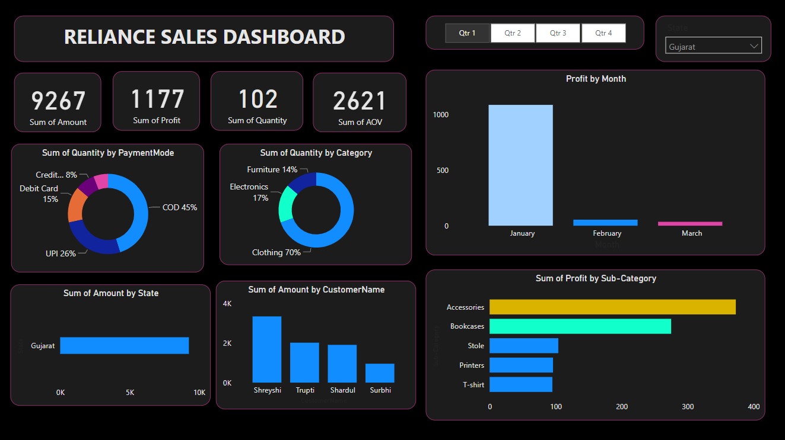

# Reliance Mart Sales Insights 🛒

**Discover sales trends at Reliance Mart!** Unveil data through our Power BI dashboard. Analyze quarters, territories, and visualize with ease. 📈

## Highlights 🌟

- **Quarterly Sales:** Easily explore quarterly sales trends and identify growth patterns. 📊
- **Territory Analysis:** Dive into state-wise sales variations and uncover opportunities. 🌍
- **Visual Clarity:** Interactive charts – donut, stack, slicers – make data engaging. 📈

## Files 📂

- **Orders.csv:** Order data, IDs, dates, customers, and states.
- **Details.csv:** Product specifics, quantities, prices, and profits.
- **RelianceDashboard.pbix:** Interactive Power BI dashboard for insights.

## Quick Preview 👀

- 
-  Gujarat's Quarter-1 data.
- 
- West Bengal's Quarter-3 sales.

## Get Started 🚀

1. **Install Power BI:** Get it from [powerbi.microsoft.com](https://powerbi.microsoft.com).
2. **Open RelianceDashboard.pbix:** Explore our insights.
3. **Navigate with Ease:** Hover, click slicers, and uncover insights!

## Collaborate ✨

Connect with me on LinkedIn: [Vaibhav Mishra](https://www.linkedin.com/in/vaibhav-mishra-vm/).

Contribute ideas, enhancements, or fixes via pull requests or issues in our GitHub repository. Let's illuminate together!

## License 📜

Under the MIT License. Details in 'LICENSE'. Thank you for exploring Reliance Mart Sales Insights. Enjoy the journey! 🚀
